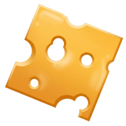

### Cheesestrap 

[](https://github.com/nenquen/cheesestrap/actions/workflows/build.yml) [](LICENSE)

A small roblox client bootstrapper. No official installer, the client is
downloaded into our own `clients/` folder and updated before every launch.

The interface is a ratatui TUI painted inside our own window through egui, so
there is no console and no terminal window behind it.

## Build

The toolchain is pinned in `rust-toolchain.toml`, msvc only.

```
cargo build --release
```

The exe lands in `target/release/cheesestrap.exe` as a gui binary. The icon is
built at compile time from `assets/branding/macncheese-512.png`.

## Installer

Needs Inno Setup 6.

```
cd installer
powershell -ExecutionPolicy Bypass -File make-wizard-art.ps1
& "${env:ProgramFiles(x86)}\Inno Setup 6\ISCC.exe" Cheesestrap.iss
```

`make-wizard-art.ps1` regenerates `wizard.bmp` and `wizard-small.bmp` from the
branding logo, run it after changing the logo. The setup lands in
`installer/output/`.

## Where things go

Everything lives next to the exe, so under `C:\Program Files\Cheesestrap`:

- `clients/` downloaded roblox builds, one folder per version guid
- `logs/` log files, only written when the setting is on
- `settings.json`

## CI

`.github/workflows/build.yml` builds the app and then the setup exe on every
push, and uploads both as artifacts.

`.github/workflows/release.yml` does the same and then publishes a github
release with the setup exe attached. Push the `release` tag to cut one, the
notes come from the top entry of the changelog below.

## Changelog

### 1.0.4

- updates are mandatory now, there is no later and no way past it
- the update screen just says what arrived and what you are on, nothing more

### 1.0.3

- the update screen owns the whole window while it is up, no panels peeking
  out from behind it
- the app relaunches itself once the update finished installing, the silent
  setup was swallowing the postinstall launch so it just stayed closed

### 1.0.2

- self update: the app checks the github releases api on launch and shows a
  notice when a newer version exists, pressing update downloads the setup and
  reinstalls over the running app
- release workflow: pushing the `release` tag builds the setup and publishes
  it as a release with the matching changelog entry as the notes
- webview2 detection reads the 32 bit registry view, which is where the x64
  runtime actually registers itself, it was reporting a healthy install as
  missing

### 1.0.1

- webview2 repair: replaces the old delete webview2 setting, which left a
  stale edge registration behind and made roblox pop an install dialog with
  nothing to install from
- setup and exe keep all their data next to the exe instead of appdata
- desktop shortcut no longer carries x64 in its name

### 1.0.0

- first public build
